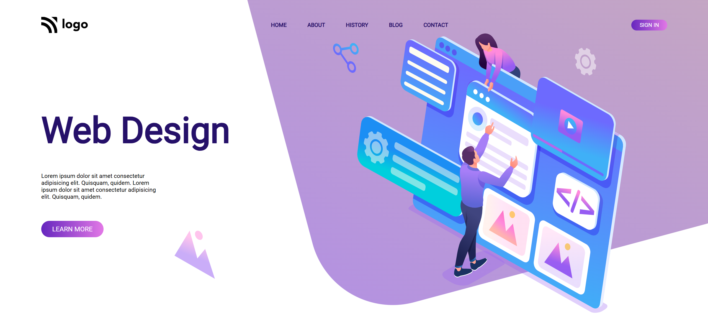
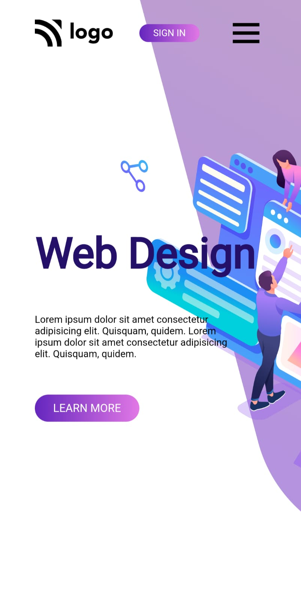

# 🎨 Design Landing Page

This is a modern and responsive landing page focused on web design. The layout is clean and vibrant, with engaging visuals and interactive elements, creating an appealing user experience across devices.

---

## 🌟 Features
- **Modern Design:** Aesthetic layout with attention to detail and color harmony.
- **Responsive Navbar:** Dynamic navigation bar with a hamburger menu for smaller screens.
- **Engaging Visuals:** Includes SVG graphics and gradient backgrounds for an immersive look.
- **Call-to-Action Buttons:** Encourages user interaction with prominent buttons.
- **Optimized Layout:** Balanced structure for text and visuals.

---

## 📖 Table of Contents
1. [Technologies Used](#technologies-used)
2. [Sections Overview](#sections-overview)
3. [How to Use](#how-to-use)
4. [Screenshots](#screenshots)
5. [Feedback](#feedback)

---

## 🛠️ Technologies Used
- **HTML5**: Semantic structure for content.
- **CSS3**: For styling and layout design.
- **JavaScript**: To handle interactivity and toggle functionality.
- **Boxicons**: For consistent and stylish icons.

---

## 📋 Sections Overview
### 1. **Navbar**
- Dynamic navigation with hover effects.
- Hamburger menu for mobile responsiveness.

### 2. **Intro Section**
- Title and description about web design.
- Button for exploring more.
- Visual elements like vector images and gradient shapes for added depth.

### 3. **Responsive Design**
- Optimized layout for desktop, tablet, and mobile devices.

---

## ⚙️ How to Use
1. Clone the repository:
   ```bash
   git clone https://github.com/NitinTSutar/css-3-landing_page.git
   ```
2. Navigate to the project folder:
   ```bash
   cd design-landing-page
   ```
3. Open `index.html` in your browser to view the page.

---

## 🖼️ Screenshots
### Desktop View


### Mobile View


---

## 💬 Feedback
I’d love to hear your thoughts! Feel free to connect with me:
- **[GitHub](https://github.com/NitinTSutar)**
- **[Email](mailto:nitintsuthar67@gmail.com)**

If you encounter any issues or have suggestions, feel free to open an issue or submit a pull request. 😊
